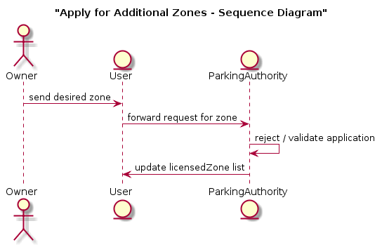
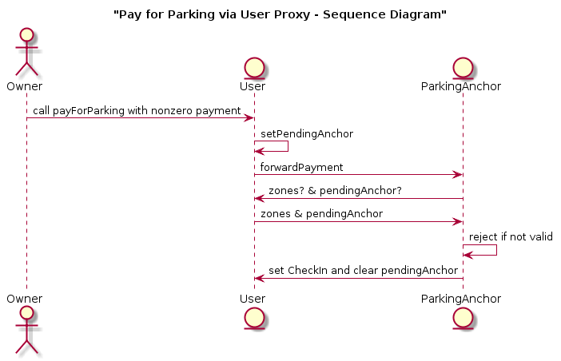

# Application Flow

## Register a User

In order to register as a User, simply call the `registerUser` function in the ParkingAuthority master contract. This will deploy a `User` proxy-contract which is owned by the caller. The master contract can validate the application with additional logic, currently this is mocked by accepting all applications.

## Register an Anchor

In order to register an anchor, call the `registerParkingAnchor` function in the ParkingAuthority master contract. This function takes 2 arguments, an `anchorId` and a `geohash`. The `anchorId` is just a stand-in for any other auxilliary data required to be a ParkingAnchor. The ParkingAuthorty validates the application (currently mocked to accept all applications), then deploys the ParkingAnchor proxy-contract which is owned by the caller. The ParkingAuthority then registers the parking anchor as a Crypto Spatial Coordinate (see CSC.sol) with the Foam Crypto Spatial Registry contract (see FoamCSR.sol). 

## Apply for zone

A zone is defined as a geohash corresponding to a bounded box on the map of a fixed resolution (in this case, a bytestring of length 4 bytes). The FoamCSR contract and CSC standard uses a bytestring of lenghth 8-bytes to represent the coordinates of the ParkingAnchor. Thus, a ParkingAnchor is *in a zone* if the first 4 bytes of the anchor's geohash match the zone's geohash.

A User can apply to the ParkingAuthority for the ability to park in a certain zone using the `requestZone` function and supplying the desired zone as an argument. The ParkingAuthority validates the application (currently the authority accepts all applications), then updates the User's set of licensed zones.

## Pay for parking

In order to pay for parking, the owner of a `User` proxy-contract calls the `payForParking` function supplying the address of the desired ParkingAnchor as an argument as well payment for parking. Currently the only requirement is that the payment is non-zero. The ParkingAnchor checks that the User is allowed to park in the zone that it occupies, then accepts the funds or denies the request. It then sets state in the `User` proxy-contract indicating that the `User` is currently parked there.

